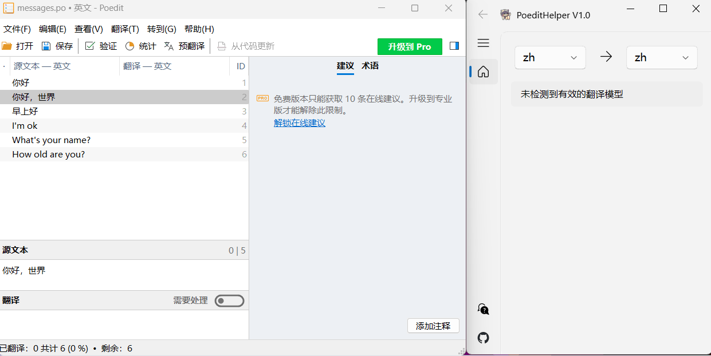

# PoeditHelper
[README_ZH](README.md)  
Poedit translation helper based on machine learning translation library.  

----
# Demo

# ModelDownload  
Translation models for other languages can be downloaded here.  
[TranslationModelDownload]  
https://raw.githubusercontent.com/argosopentech/argospm-index/main/index.json  
[TranslationModelDownload-dev]  
https://raw.githubusercontent.com/argosopentech/argospm-index-dev/main/index.json  

# Tested  
- Python3.9  
- Poedit 3.4.4  

# Usage  
`pip install -r requirements.txt`  
`python main.py`  
Then  
1、 Open Poedit.  
2、 Open PoeditHelper.  
3、 Load po-file.  
4、 Select translation type.  
5、 Click on the text in Poedit and PoeditHelper will translate it automatically.  
6、 Clicking on the translated text in PoeditHelper automatically fills in Poedit.  